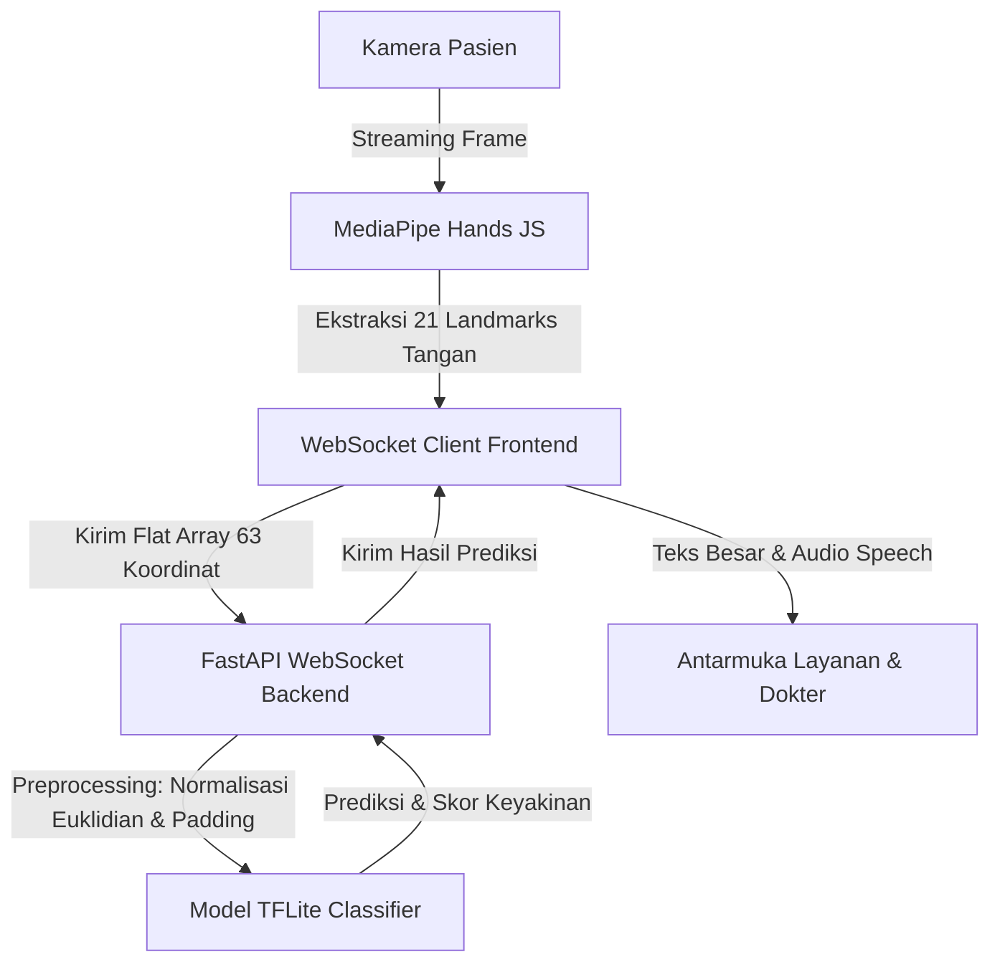

# Panduan Overview & Rencana Kerja Dataset (To-Do Septi) - MedSign AI 🤟

Dokumen ini berisi penjelasan menyeluruh tentang sistem **MedSign AI** (Sistem Pendukung Komunikasi Medis Tunarungu Berbasis BISINDO) beserta **Checklist & To-Do List** detail untuk **Septi** (sebagai ML & Dataset Engineer) dalam mengumpulkan dataset rill, memverifikasi kualitas data, melatih model, hingga mengekspor model siap pakai ke backend.

---

## 📋 1. Gambaran Umum Program (Project Overview)

**MedSign AI** adalah aplikasi asisten komunikasi medis dua arah untuk menjembatani hambatan komunikasi antara pasien tunarungu (Teman Tuli) dan tenaga medis di fasilitas kesehatan (Puskesmas, Klinik, Rumah Sakit).

### ⚙️ Cara Kerja Sistem (Data Flow):


### 🌟 Fitur Utama Aplikasi (MVP):
1. **Deteksi Kamera Real-Time (`CameraFeed.jsx`)**: Menampilkan visualisasi feed kamera browser yang dilapis overlay kerangka (skeleton) tangan 21 titik berbasis MediaPipe secara berlatensi rendah.
2. **Penerjemah Hibrida (`TranslationDisplay.jsx`)**:
   - **Mode Kosakata Medis (Clinical Mode)**: Menerjemahkan gerakan dinamis sepanjang 1 detik (30 frame) menggunakan model **LSTM** untuk mengenali kata medis utuh.
   - **Mode Eja (Spelling Mode)**: Menerjemahkan bentuk abjad statis (1 frame) menggunakan model **MLP Jaringan Saraf** untuk mengeja nama/singkatan kustom.
3. **Respon Medis Dokter (`DoctorPanel.jsx`)**: Panel khusus dokter untuk mengetik pesan bebas atau menekan tombol pintas instruksi medis (10 preset) yang secara otomatis diubah menjadi suara (*Text-to-Speech* Bahasa Indonesia).
4. **Panduan Kosakata Pintasan (`VocabularyGuide.jsx`)**: Grid 35 kosakata medis prioritas yang terbagi dalam 5 kategori. Berfungsi sebagai tombol darurat bila kamera atau pencahayaan ruangan buruk.
5. **Pencatatan Sesi & Ekspor (`SessionLog.jsx`)**: Menyimpan log percakapan dua arah terstruktur (Pasien & Dokter) yang dapat disalin atau diekspor ke berkas `.txt` untuk diintegrasikan dengan Rekam Medis Elektronik (RME).
6. **Blinking Emergency Alert (`EmergencyAlert.jsx`)**: Mengaktifkan alarm visual berkedip merah jika sistem mendeteksi kata-kata bernilai darurat (*emergency*) seperti "pingsan", "sesak", "tidak bisa bernapas", atau "nyeri dada".

---

## 🛠️ 2. Arsitektur Machine Learning & Pipeline Data

Sistem kecerdasan buatan MedSign AI menggunakan koordinat numerik (bukan frame video JPG mentah) untuk menjaga performa di CPU dan privasi data pasien.

### A. Preprocessing Koordinat (`preprocess.py`):
Sebelum masuk ke model latih, koordinat harus melalui dua tahapan penyesuaian:
1. **Invarian Posisi (Origin Shift)**: Mengurangi koordinat seluruh 21 sendi dengan koordinat pergelangan tangan (wrist / Titik 0) sehingga koordinat tangan bersifat relatif terhadap posisinya di layar.
2. **Invarian Skala (Scale Normalization)**: Membagi koordinat dengan jarak euklidian terbesar dari pergelangan tangan ke ujung jari. Hal ini memastikan ukuran tangan tetap seragam tidak peduli dekat atau jauhnya pasien dari kamera.

### B. Struktur Model:
- **Model Kosakata Medis (LSTM)**:
  - Input: Sequence temporal dengan ukuran tetap `(30 frame, 63 koordinat)`.
  - Target: 30 Kelas Kosakata Medis Klinis.
  - Model: 2-layer LSTM + Dropout + Dense Softmax.
  - Output File: `medsign_v1.tflite` (~338 KB).
- **Model Abjad BISINDO A-Z (Dense MLP)**:
  - Input: Frame statis tunggal dengan ukuran `(1, 63 koordinat)`.
  - Target: 26 Kelas Huruf Abjad (A–Z).
  - Model: Dense Jaringan Saraf (Multi-Layer Perceptron).
  - Output File: `bisindo_alphabet_v1.tflite` (~38 KB).

---

## 📝 3. Checklist & To-Do List Septi (Dataset & ML)

Tugas utama **Septi** adalah mengumpulkan dataset riil gerakan tangan medis dari rekan-rekan/sukarelawan, melakukan verifikasi terhadap kualitas tangkapan data, serta melakukan pelatihan model ML secara lokal.

### 🟥 TAHAP 1: Setup Lingkungan Kerja (Virtual Environment)
- [ ] Buat dan aktifkan python virtual environment di folder `backend/`:
  ```powershell
  cd backend
  python -m venv venv
  .\venv\Scripts\activate
  ```
- [ ] Pasang seluruh dependensi yang diperlukan:
  ```powershell
  pip install -r requirements.txt
  pip install opencv-python mediapipe matplotlib scikit-learn tensorflow
  ```

### 🟧 TAHAP 2: Pengumpulan Dataset Riil (Real Dataset Recording)
*Catatan: Saat ini dataset yang ada di `backend/data/` adalah data sintetis (buatan komputer). Septi perlu melengkapi/menggantinya dengan data riil menggunakan kamera.*
- [ ] Buka dan pelajari script perekam data: [collect_data.py](file:///d:/PKM/medsign-ai/backend/training/collect_data.py).
- [ ] Jalankan program perekaman data untuk merekam gerakan isyarat:
  ```powershell
  python training/collect_data.py
  ```
- [ ] Rekam setiap kata dari **30 Kosakata Medis MVP** berikut. Pastikan setiap kata memiliki minimal **30-45 sequence perekaman (.npy)** dengan masing-masing sequence sepanjang **30 frame (1 detik)**:
  
  | Kategori | Kosakata Medis yang Harus Direkam |
  | :--- | :--- |
  | **Keluhan** | `sakit`, `nyeri`, `sesak`, `batuk`, `demam`, `pusing`, `mual`, `muntah`, `diare`, `lemas` |
  | **Lokasi Tubuh** | `kepala`, `dada`, `perut`, `tenggorokan`, `tangan`, `kaki`, `punggung`, `mata`, `telinga`, `leher` |
  | **Respons** | `ya`, `tidak`, `sakit sekali`, `lebih baik`, `lebih buruk` |
  | **Darurat** | `tolong`, `tidak bisa bernapas`, `nyeri dada`, `pingsan`, `bantuan segera` |

  > [!TIP]
  > *Jaga pencahayaan tetap stabil selama proses perekaman. Usahakan tangan berada sepenuhnya di dalam jangkauan kamera (tidak terpotong di tepi frame).*

### 🟨 TAHAP 3: Verifikasi & Visualisasi Kualitas Data (Data Quality Check)
- [ ] Buka script utilitas visualisasi: [visualize_landmarks.py](file:///d:/PKM/medsign-ai/backend/training/visualize_landmarks.py).
- [ ] Jalankan visualisasi sampel data isyarat untuk memeriksa apakah kerangka 3D tangan terekam dengan bersih tanpa anomali lompatan koordinat:
  ```powershell
  python training/visualize_landmarks.py
  ```
- [ ] Periksa folder [backend/training/visualization/](file:///d:/PKM/medsign-ai/backend/training/visualization/) dan lihat file gambar `_pose.jpg` hasil render 3D (Awal, Tengah, Akhir gerakan) untuk mendeteksi frame kosong (diwakili array berisi nol/zeros) akibat tangan luput dari deteksi MediaPipe.

### 🟩 TAHAP 4: Pelatihan Model LSTM (Model Training & Evaluation)
- [ ] Buka script pelatihan model: [train_lstm.py](file:///d:/PKM/medsign-ai/backend/training/train_lstm.py).
- [ ] Jalankan proses pelatihan model LSTM menggunakan data yang telah terkumpul:
  ```powershell
  python training/train_lstm.py
  ```
- [ ] Amati riwayat akurasi latihan dan validasi. Target akurasi minimal model pada test set adalah **$\ge 90\%$**. Jika akurasi belum tercapai:
  - Lakukan perekaman ulang pada kata yang memiliki akurasi klasifikasi rendah (dapat diidentifikasi jika terjadi misklasifikasi konstan).
  - Naikkan parameter augmentasi spasial di script training untuk memperkaya variabilitas.

### 🟦 TAHAP 5: Konversi & Optimasi Model ke TFLite
- [ ] Pastikan proses konversi otomatis di akhir script `train_lstm.py` berjalan sukses.
- [ ] Verifikasi bahwa file model `medsign_lstm.h5` dan `medsign_v1.tflite` sudah terbentuk di folder [backend/models/](file:///d:/PKM/medsign-ai/backend/models/).
- [ ] Jika ingin melatih ulang model abjad statis (Spelling A-Z):
  1. Jalankan `python training/process_alphabet_data.py` untuk mengekstrak landmarks dari gambar XML.
  2. Jalankan `python training/train_alphabet_model.py` untuk menghasilkan file `bisindo_alphabet_v1.tflite` di folder `backend/models/`.

### 🟪 TAHAP 6: Integrasi & Pengujian Akhir Backend
- [ ] Aktifkan server backend FastAPI lokal Anda:
  ```powershell
  python app/main.py
  ```
- [ ] Buka browser dan periksa Swagger UI di `http://localhost:8000/docs` untuk menguji endpoint `/health`. Pastikan parameter `"mode"` bernilai `"production"` (artinya model TFLite sukses terdeteksi dan dimuat oleh backend, bukan fallback mode "geometris").
- [ ] Jalankan frontend di folder `frontend/` (`npm run dev`) dan lakukan uji coba gestur tangan langsung di depan kamera laptop. Pastikan respons interpretasi lancar dengan latensi $\le 200\text{ ms}$.

---

## 📂 4. Daftar File Penting untuk Modul ML & Dataset

Berikut adalah tautan langsung ke file-file yang akan sering diakses oleh Septi selama masa pengerjaan:
1. **Script Perekam**: [collect_data.py](file:///d:/PKM/medsign-ai/backend/training/collect_data.py) — Mengumpulkan sequence koordinat tangan (.npy) dari webcam.
2. **Generator Sintetis**: [generate_synthetic_data.py](file:///d:/PKM/medsign-ai/backend/training/generate_synthetic_data.py) — Membuat data koordinat sintetis sebagai baseline uji awal.
3. **Script Training**: [train_lstm.py](file:///d:/PKM/medsign-ai/backend/training/train_lstm.py) — Melatih arsitektur jaringan LSTM dan mengonversinya ke TFLite.
4. **Visualisasi**: [visualize_landmarks.py](file:///d:/PKM/medsign-ai/backend/training/visualize_landmarks.py) — Memetakan koordinat biner `.npy` ke rangka gambar JPG 3D.
5. **Preprocessing**: [preprocess.py](file:///d:/PKM/medsign-ai/backend/app/ml/preprocess.py) — Melakukan normalisasi invarian posisi & skala pada koordinat tangan.
6. **Model Loader**: [model.py](file:///d:/PKM/medsign-ai/backend/app/ml/model.py) — Memuat interpreter model TFLite dan mengeksekusi inferensi di backend.
7. **Pustaka Kosakata**: [vocabulary.js](file:///d:/PKM/medsign-ai/frontend/src/data/vocabulary.js) — Menyimpan daftar metadata 35 kosakata medis prioritas di frontend.
