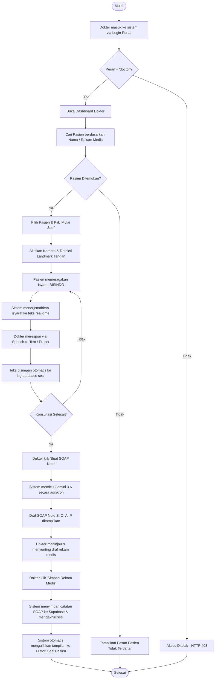
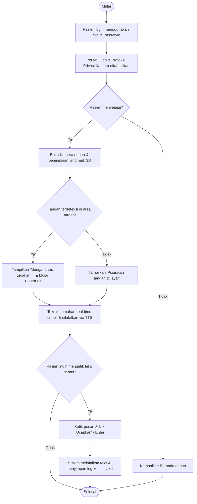
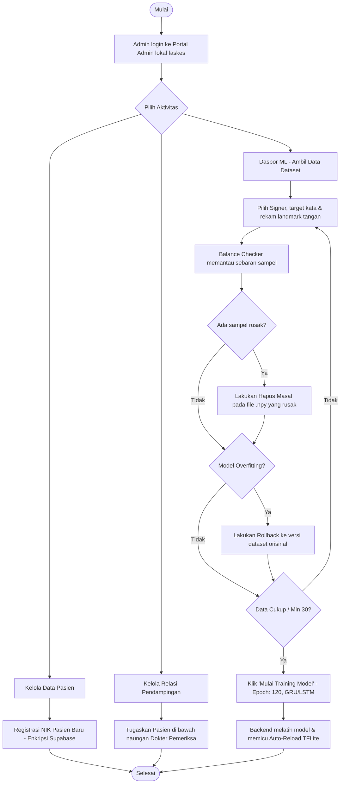
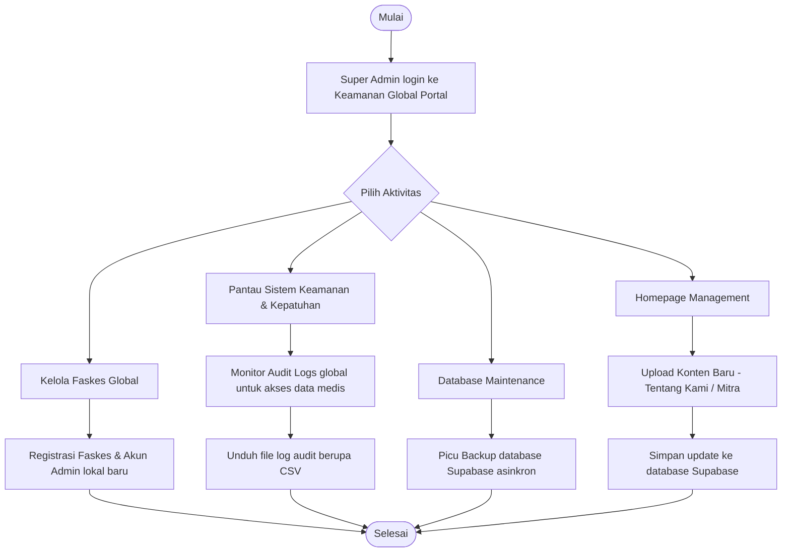

# Diagram Activity - MedSign AI

Dokumen ini mendefinisikan diagram aktivitas alur kerja (workflow) untuk masing-masing aktor dalam sistem MedSign AI.

## 1. Alur Aktivitas Dokter (Konsultasi & SOAP Note)

## 2. Alur Aktivitas Pasien (Translasi & TTS)

## 3. Alur Aktivitas Admin (Pendaftaran & Pelatihan Model)

## 4. Alur Aktivitas Super Admin (Manajemen Keamanan & Faskes)

